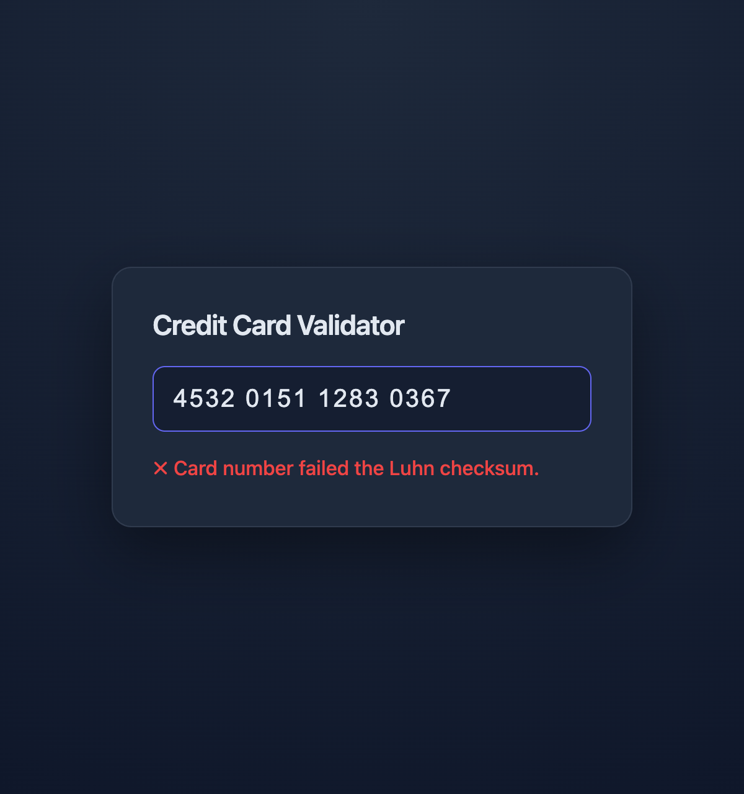

# Credit Card Validator

Validates credit card numbers against the **Luhn checksum** on the backend, with live
feedback and card-network detection on the frontend.

| Valid                                | Invalid                                  |
| ------------------------------------ | ---------------------------------------- |
|  |  |

## Stack

React 19 · Vite · TypeScript (client) — Node · Express 5 · TypeScript (server) — axios —
Vitest · Supertest · Testing Library — npm workspaces with a shared types package.

## Setup

Node ≥ 18.

```bash
git clone https://github.com/sushruth31/credit-card-validator.git
cd credit-card-validator
npm install   # all three workspaces
npm run dev   # API :3001 · UI :5173
```

`npm run build` · `npm test` (47 tests across both packages). Config via env, with sensible
defaults: `PORT`, `CORS_ORIGIN` (server) · `VITE_API_URL` (client).

## API

`POST /api/validate` — body `{ "cardNumber": "4532 0151 1283 0366" }` (spaces/dashes accepted).

```json
{ "valid": true, "cardType": "Visa" }
{ "valid": false, "error": "Card number failed the Luhn checksum." }
```

A valid request always returns `200` (validity is in the body); a malformed request returns a
`4xx` with `{ valid, error, code }`. `cardType`: Visa · Mastercard · Amex · Discover · Unknown.
Liveness: `GET /health`.

## Design

- **Validation is backend-only** — per spec, and the right call: client checks never gate trust.
- **One contract, one source.** `shared/` holds the request/response types; both sides import
  them as type-only, so contract drift is a compile error, not a production bug.
- **Luhn is a pure function**; sanitisation, structural rules, and card-type detection compose
  it inside a `CardValidator` service — each piece unit-tested in isolation.
- **Error handling is centralized both sides** — one axios interceptor normalizes every
  transport failure into an `ApiError`; one Express `errorHandler` renders `ValidationError`s
  and body-parser faults with the right status and code.
- **No database or auth** — intentionally out of scope, not overlooked.

## Extending

Built to grow without rework:

- **New endpoint** → a router + one line in `app.ts`; CORS, body limits, and error handling
  already apply. The matching client call is a one-liner in `api/cardValidator.ts`.
- **New validation rule** → one method in `CardValidator`. **New card network** → one line in
  `cardType.ts`. **Contract change** → edit `shared/types.ts`; both sides fail to compile until fixed.
- `buildApp()` is decoupled from startup, so the API is tested without binding a port.

## Tests

`npm test` (47):

- **Backend** (Vitest + Supertest) — Luhn checksum, card-type detection, the validation
  pipeline (full edge matrix), and the HTTP layer: `200 / 400 / 413 / malformed JSON / health`.
- **Frontend** (Vitest + Testing Library) — component behaviour (valid, invalid, network
  failure, live formatting, clearing) and the interceptor's error mapping.

## Structure

```
shared/      types.ts                       # one contract, imported by both sides
client/src/  App.tsx · api/{client,cardValidator}.ts · format.ts
server/src/  index.ts · app.ts · validateRoute.ts · middleware/validateRequest.ts
             errorHandler.ts · errors.ts · config.ts · cardValidator.ts · luhn.ts · cardType.ts
```
